##Introduction to Dataset

To apply for a master's degree is a very expensive and intensive work. With this kernel, students will guess their capacities and they will decide whether to apply for a master's degree or not.
This dataset is created for prediction of graduate admissions and the dataset link is below:
https://www.kaggle.com/mohansacharya/graduate-admissions

Features in the dataset (from Kaggle):

GRE Scores (290 to 340)
TOEFL Scores (92 to 120)
University Rating (1 to 5)
Statement of Purpose (1 to 5)
Letter of Recommendation Strength (1 to 5)
Undergraduate CGPA (6.8 to 9.92)
Research Experience (0 or 1)
Chance of Admit (0.34 to 0.97)

###Task
The task is to predict "Chance of Admit" if other criteria like GRE Score, TOEFL Score ,University Ranking,SOP,LOR,CGPA and Research Experience are provided.

###Tools Used
R, R Markdown,Shiny(For Predictor webwidget),Shinydashboard (for dashboard)

###Algorithm Used
Multiple Linear Regression, Random Forest Regression, Decision Tree Regression
*Note other powerful supervised machine learning model can be used to bring more accuracy.But this demo is based on few regression model for example purpose only.

###Package Installed 


```r
library(ggplot2)
library(dplyr)
library(reshape2) #For correlation heatmap
library(stringr)
library(randomForest)
library(rpart)
```

##Dataset Overview


```r
data <- read.csv("Admission Predict.csv")
colnames(data) <- c("Serial Number","GRE Scores","TOEFL Scores","University Ranking","SOP","LOR","CGPA","Research","Chance of Admit")
```

###Summary

```r
summary(data)
```

```
##  Serial Number     GRE Scores     TOEFL Scores   University Ranking
##  Min.   :  1.0   Min.   :290.0   Min.   : 92.0   Min.   :1.000     
##  1st Qu.:125.8   1st Qu.:308.0   1st Qu.:103.0   1st Qu.:2.000     
##  Median :250.5   Median :317.0   Median :107.0   Median :3.000     
##  Mean   :250.5   Mean   :316.5   Mean   :107.2   Mean   :3.114     
##  3rd Qu.:375.2   3rd Qu.:325.0   3rd Qu.:112.0   3rd Qu.:4.000     
##  Max.   :500.0   Max.   :340.0   Max.   :120.0   Max.   :5.000     
##       SOP             LOR             CGPA          Research   
##  Min.   :1.000   Min.   :1.000   Min.   :6.800   Min.   :0.00  
##  1st Qu.:2.500   1st Qu.:3.000   1st Qu.:8.127   1st Qu.:0.00  
##  Median :3.500   Median :3.500   Median :8.560   Median :1.00  
##  Mean   :3.374   Mean   :3.484   Mean   :8.576   Mean   :0.56  
##  3rd Qu.:4.000   3rd Qu.:4.000   3rd Qu.:9.040   3rd Qu.:1.00  
##  Max.   :5.000   Max.   :5.000   Max.   :9.920   Max.   :1.00  
##  Chance of Admit 
##  Min.   :0.3400  
##  1st Qu.:0.6300  
##  Median :0.7200  
##  Mean   :0.7217  
##  3rd Qu.:0.8200  
##  Max.   :0.9700
```


```r
head(data)
```

```
##   Serial Number GRE Scores TOEFL Scores University Ranking SOP LOR CGPA
## 1             1        337          118                  4 4.5 4.5 9.65
## 2             2        324          107                  4 4.0 4.5 8.87
## 3             3        316          104                  3 3.0 3.5 8.00
## 4             4        322          110                  3 3.5 2.5 8.67
## 5             5        314          103                  2 2.0 3.0 8.21
## 6             6        330          115                  5 4.5 3.0 9.34
##   Research Chance of Admit
## 1        1            0.92
## 2        1            0.76
## 3        1            0.72
## 4        1            0.80
## 5        0            0.65
## 6        1            0.90
```


```r
ncol(data)
```

```
## [1] 9
```

```r
nrow(data)
```

```
## [1] 500
```

```r
colnames(data)
```

```
## [1] "Serial Number"      "GRE Scores"         "TOEFL Scores"      
## [4] "University Ranking" "SOP"                "LOR"               
## [7] "CGPA"               "Research"           "Chance of Admit"
```


```r
apply(data, MARGIN = 2, function(x) sum(is.na(x)))
```

```
##      Serial Number         GRE Scores       TOEFL Scores 
##                  0                  0                  0 
## University Ranking                SOP                LOR 
##                  0                  0                  0 
##               CGPA           Research    Chance of Admit 
##                  0                  0                  0
```

There are 9 columns :Serial Number,GRE Scores,TOEFL Scores,University Ranking,SOP,LOR,CGPA,Research,Chance of Admit.
<br/>
There are 500 row in total.
<br/>
There are no null value. So we dont need to deal with null values.
<br/>
Serial Number is not important in this dataset for further purpose because it contain index value.


##Correlation between Columns

Correlation is a statistical technique that can show whether and how strongly pairs of variables are related.The main result of a correlation is called the correlation coefficient (or "r"). It ranges from -1.0 to +1.0. The closer r is to +1 or -1, the more closely the two variables are related.
<br/>
If r is close to 0, it means there is no relationship between the variables. If r is positive, it means that as one variable gets larger the other gets larger. If r is negative it means that as one gets larger, the other gets smaller 

###Compute correlation matrix

```r
cormat <-round(cor(data),2)
head(cormat)
```

```
##                    Serial Number GRE Scores TOEFL Scores
## Serial Number               1.00      -0.10        -0.14
## GRE Scores                 -0.10       1.00         0.83
## TOEFL Scores               -0.14       0.83         1.00
## University Ranking         -0.07       0.64         0.65
## SOP                        -0.14       0.61         0.64
## LOR                         0.00       0.52         0.54
##                    University Ranking   SOP  LOR  CGPA Research
## Serial Number                   -0.07 -0.14 0.00 -0.07    -0.01
## GRE Scores                       0.64  0.61 0.52  0.83     0.56
## TOEFL Scores                     0.65  0.64 0.54  0.81     0.47
## University Ranking               1.00  0.73 0.61  0.71     0.43
## SOP                              0.73  1.00 0.66  0.71     0.41
## LOR                              0.61  0.66 1.00  0.64     0.37
##                    Chance of Admit
## Serial Number                 0.01
## GRE Scores                    0.81
## TOEFL Scores                  0.79
## University Ranking            0.69
## SOP                           0.68
## LOR                           0.65
```
###Create correlation heatmap


```r
melted_cormat <- melt(cormat)
head(melted_cormat)
```

```
##                 Var1          Var2 value
## 1      Serial Number Serial Number  1.00
## 2         GRE Scores Serial Number -0.10
## 3       TOEFL Scores Serial Number -0.14
## 4 University Ranking Serial Number -0.07
## 5                SOP Serial Number -0.14
## 6                LOR Serial Number  0.00
```


```r
ggplot(data = melted_cormat, aes(x=Var1, y=Var2, fill=value)) + 
  geom_tile()
```

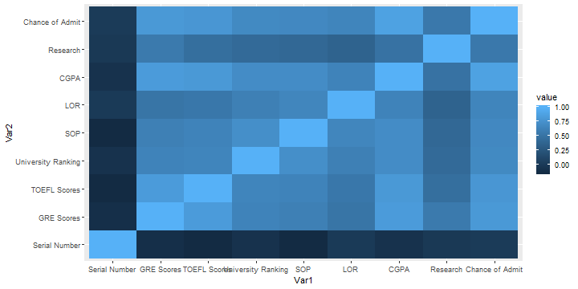

####Get lower and triangle of the correlation matrix

```r
get_lower_tri<-function(cormat){
  cormat[upper.tri(cormat)] <- NA
  return(cormat)
}

get_upper_tri <- function(cormat){
  cormat[lower.tri(cormat)]<- NA
  return(cormat)
}

upper_tri <- get_upper_tri(cormat)
```


####Finished correlation matrix heatmap

```r
melted_cormat <- melt(upper_tri, na.rm = TRUE)

       #Heatmap
ggplot(data = melted_cormat, aes(Var2, Var1, fill = value))+
  geom_tile(color = "white")+
  scale_fill_gradient2(low = "blue", high = "red", mid = "white", 
                       midpoint = 0, limit = c(-1,1), space = "Lab", 
                       name="Pearson\nCorrelation") +
  theme_minimal()+ 
  theme(axis.text.x = element_text(angle = 45, vjust = 1, 
                                   size = 12, hjust = 1))+
  coord_fixed()
```

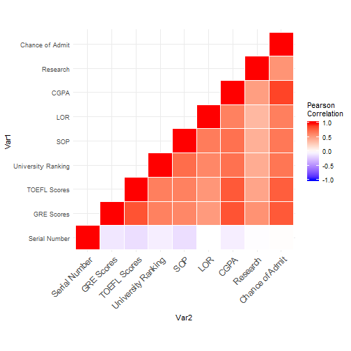

####Reorder the correlation matrix


```r
reorder_cormat <- function(cormat){
  #Use correlation between variables as distance
  dd <- as.dist((1-cormat)/2)
  hc <- hclust(dd)
  cormat <-cormat[hc$order, hc$order]
}

cormat <- reorder_cormat(cormat)
upper_tri <- get_upper_tri(cormat)
# Melt the correlation matrix
melted_cormat <- melt(upper_tri, na.rm = TRUE)
# Create a ggheatmap
ggheatmap <- ggplot(melted_cormat, aes(Var2, Var1, fill = value))+
  geom_tile(color = "white")+
  scale_fill_gradient2(low = "blue", high = "red", mid = "white", 
                       midpoint = 0, limit = c(-1,1), space = "Lab", 
                       name="Pearson\nCorrelation") +
  theme_minimal()+ # minimal theme
  theme(axis.text.x = element_text(angle = 45, vjust = 1, 
                                   size = 12, hjust = 1))+
  coord_fixed()
# Print the heatmap
print(ggheatmap)
```

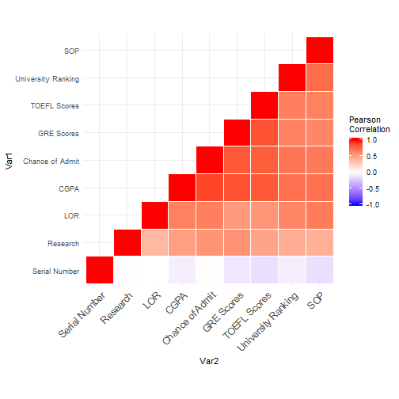

####Add correlation coefficients on the heatmap

```r
ggheatmap + 
  geom_text(aes(Var2, Var1, label = value), color = "black", size = 4) +
  theme(
    axis.title.x = element_blank(),
    axis.title.y = element_blank(),
    panel.grid.major = element_blank(),
    panel.border = element_blank(),
    panel.background = element_blank(),
    axis.ticks = element_blank(),
    legend.justification = c(1, 0),
    legend.position = c(0.6, 0.7),
    legend.direction = "horizontal")+
  guides(fill = guide_colorbar(barwidth = 7, barheight = 1,
                               title.position = "top", title.hjust = 0.5))
```

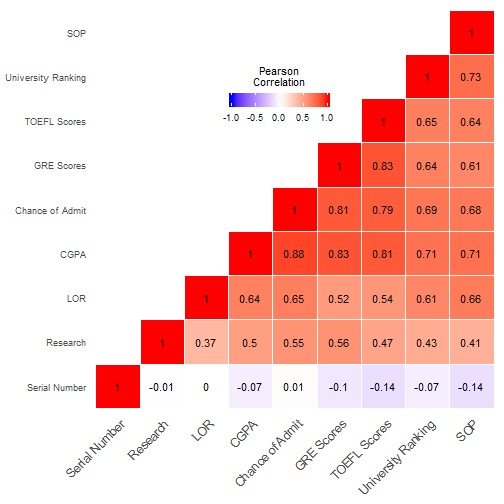

The 3 most important features for admission to the Master: CGPA, GRE Score, and TOEFL Score.
<br/>
The 3 least important features for admission to the Master: Research, LOR, and SOP

##Data visualization to understand dataset

####1.Having Research or not:


```r
researchtable <-data.frame(table(data$Research))
colnames(researchtable) <- c("Status","Frequency")
researchtable$Status <-str_replace_all(researchtable$Status,"0","Not Having Research")
researchtable$Status <-str_replace_all(researchtable$Status,"1","Having Research")

p <- ggplot(data=researchtable, aes(x=researchtable$Status,y=researchtable$Frequency)) +geom_bar(stat = "identity",aes(fill=Status))+ geom_text(aes(label=Frequency),vjust=-0.5, position = position_dodge(width = 1), size = 4)
p <- p+ labs(x="Candidates",y="Frequency",title = "Research Experience")
p<- p + theme_bw()+theme(legend.position="bottom")
p <- p+theme(legend.text=element_text(size=10), legend.title=element_text(size=14))
p <- p + theme(axis.text.x=element_text(color="black", size=15, face="bold"),
               plot.title = element_text(color="black", size=15, face="bold"),
               axis.text.y=element_text(colour="grey20", face="bold", hjust=1, vjust=0.8, size=10),
               axis.title.y=element_text(colour="grey20", face="bold", size=12))
p <- p+scale_fill_manual(values=c("Not Having Research"="dark red","Having Research"="dark green"))
p
```

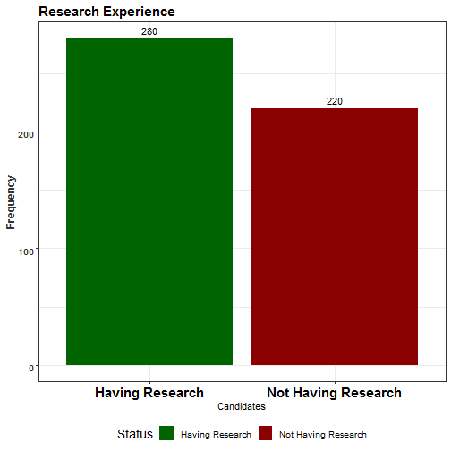

The majority of the candidates in the dataset have research experience.Therefore, the Research will be a unimportant feature for the Chance of Admit. The correlation between Chance of Admit and Research was already lower than other correlation values.

####2.TOEFL Score


```r
toeflplot <-data.frame(Name=c("Min","Max","Mean"),Teoflscore=c(min(data$`TOEFL Scores`),max(data$`TOEFL Scores`),mean(data$`TOEFL Scores`)))
p1 <- ggplot(data=toeflplot, aes(x=toeflplot$Name,y=toeflplot$Teoflscore)) +geom_bar(stat = "identity",aes(fill=Name))+ geom_text(aes(label=toeflplot$Teoflscore),vjust=-0.5, position = position_dodge(width = 1), size = 4)
p1 <- p1+ labs(x="Level",y="TOEFL Score",title = "TOEFL Scores")
p1<- p1 + theme_bw()+theme(legend.position="bottom")
p1 <- p1+theme(legend.text=element_text(size=10), legend.title=element_text(size=14))
p1 <- p1 + theme(axis.text.x=element_text(color="black", size=15, face="bold"),
               plot.title = element_text(color="black", size=15, face="bold"),
               axis.text.y=element_text(colour="grey20", face="bold", hjust=1, vjust=0.8, size=10),
               axis.title.y=element_text(colour="grey20", face="bold", size=12))
p1
```

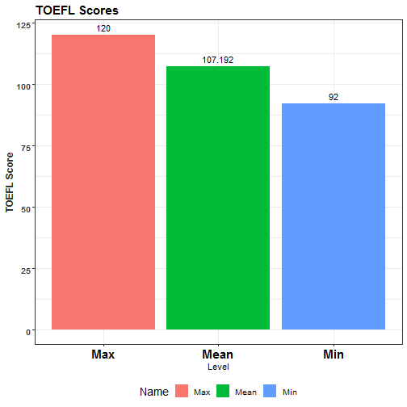

The lowest TOEFL score is 92 and the highest TOEFL score is 120. The average is 107.92


##Regression Algorithm

####Prepare data for regression and Normalize


```r
df<-read.csv("Admission Predict.csv")
colnames(df) <- c("Serial Number","GRE Scores","TOEFL Scores","University Ranking","SOP","LOR","CGPA","Research","Chance of Admit") 
df <- select(df,-c("Serial Number"))
```

There are two primary advantages of having a highly normalized data schema:

1.Consistency
<br/>
2.Easier object-to-data mapping

####Normalization (min-max scaling)

It makes values scaled to a fixed range (0-1)

```r
normalize <- function(x) {
  return ((x - min(x)) / (max(x) - min(x)))
}

dfNorm <- as.data.frame(lapply(df, normalize))
```


####Split to Train and Test Data Set (80-20)

```r
#80% of the sample size
smp_size <- floor(0.8 * nrow(dfNorm))
#Set the seed to make your partition reproducible
set.seed(123)
train_ind <- sample(seq_len(nrow(dfNorm)), size = smp_size)
train <- dfNorm[train_ind, ]
test <- dfNorm[-train_ind, ]
```

####Explore the train set


```r
attach(train)
```

```
## The following objects are masked from train (pos = 3):
## 
##     CGPA, Chance.of.Admit, GRE.Scores, LOR, Research, SOP,
##     TOEFL.Scores, University.Ranking
```

```
## The following objects are masked from train (pos = 4):
## 
##     CGPA, Chance.of.Admit, GRE.Scores, LOR, Research, SOP,
##     TOEFL.Scores, University.Ranking
```

```
## The following objects are masked from train (pos = 5):
## 
##     CGPA, Chance.of.Admit, GRE.Scores, LOR, Research, SOP,
##     TOEFL.Scores, University.Ranking
```

```
## The following objects are masked from train (pos = 6):
## 
##     CGPA, Chance.of.Admit, GRE.Scores, LOR, Research, SOP,
##     TOEFL.Scores, University.Ranking
```

```
## The following objects are masked from train (pos = 7):
## 
##     CGPA, Chance.of.Admit, GRE.Scores, LOR, Research, SOP,
##     TOEFL.Scores, University.Ranking
```

```
## The following objects are masked from train (pos = 8):
## 
##     CGPA, Chance.of.Admit, GRE.Scores, LOR, Research, SOP,
##     TOEFL.Scores, University.Ranking
```

```
## The following objects are masked from train (pos = 9):
## 
##     CGPA, Chance.of.Admit, GRE.Scores, LOR, Research, SOP,
##     TOEFL.Scores, University.Ranking
```

```
## The following objects are masked from train (pos = 10):
## 
##     CGPA, Chance.of.Admit, GRE.Scores, LOR, Research, SOP,
##     TOEFL.Scores, University.Ranking
```

```
## The following objects are masked from train (pos = 11):
## 
##     CGPA, Chance.of.Admit, GRE.Scores, LOR, Research, SOP,
##     TOEFL.Scores, University.Ranking
```

```
## The following objects are masked from train (pos = 12):
## 
##     CGPA, Chance.of.Admit, GRE.Scores, LOR, Research, SOP,
##     TOEFL.Scores, University.Ranking
```

```
## The following objects are masked from train (pos = 13):
## 
##     CGPA, Chance.of.Admit, GRE.Scores, LOR, Research, SOP,
##     TOEFL.Scores, University.Ranking
```

```
## The following objects are masked from train (pos = 14):
## 
##     CGPA, Chance.of.Admit, GRE.Scores, LOR, Research, SOP,
##     TOEFL.Scores, University.Ranking
```

```
## The following objects are masked from train (pos = 15):
## 
##     CGPA, Chance.of.Admit, GRE.Scores, LOR, Research, SOP,
##     TOEFL.Scores, University.Ranking
```

```
## The following objects are masked from train (pos = 16):
## 
##     CGPA, Chance.of.Admit, GRE.Scores, LOR, Research, SOP,
##     TOEFL.Scores, University.Ranking
```

```
## The following objects are masked from train (pos = 17):
## 
##     CGPA, Chance.of.Admit, GRE.Scores, LOR, Research, SOP,
##     TOEFL.Scores, University.Ranking
```

```
## The following objects are masked from train (pos = 18):
## 
##     CGPA, Chance.of.Admit, GRE.Scores, LOR, Research, SOP,
##     TOEFL.Scores, University.Ranking
```

```
## The following objects are masked from train (pos = 19):
## 
##     CGPA, Chance.of.Admit, GRE.Scores, LOR, Research, SOP,
##     TOEFL.Scores, University.Ranking
```

```
## The following objects are masked from train (pos = 20):
## 
##     CGPA, Chance.of.Admit, GRE.Scores, LOR, Research, SOP,
##     TOEFL.Scores, University.Ranking
```

```
## The following objects are masked from train (pos = 21):
## 
##     CGPA, Chance.of.Admit, GRE.Scores, LOR, Research, SOP,
##     TOEFL.Scores, University.Ranking
```

```
## The following objects are masked from train (pos = 22):
## 
##     CGPA, Chance.of.Admit, GRE.Scores, LOR, Research, SOP,
##     TOEFL.Scores, University.Ranking
```

```
## The following objects are masked from train (pos = 24):
## 
##     CGPA, Chance.of.Admit, GRE.Scores, LOR, Research, SOP,
##     TOEFL.Scores, University.Ranking
```

```r
require(gridExtra)
plot1=ggplot(train, aes(Chance.of.Admit)) + geom_density(fill="blue")
plot2=ggplot(train, aes(log(Chance.of.Admit))) + geom_density(fill="blue")
plot3=ggplot(train, aes(sqrt(Chance.of.Admit))) + geom_density(fill="blue")
grid.arrange(plot1,plot2,plot3,ncol=3,nrow=1)
```

```
## Warning: Removed 1 rows containing non-finite values (stat_density).
```

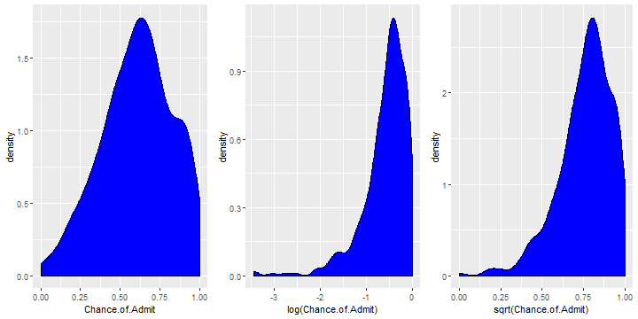

We can see that real data does a decent job to transform ‘Chance.of.Admit’ distribution closer to normal than 'log' and 'sqrt'.


####Model Building- Model1
Now as a first step we will fit the multiple regression models. We will start by taking all input variables in the multiple regression.


```r
model1 = lm(Chance.of.Admit~., data=train)
summary(model1)
```

```
## 
## Call:
## lm(formula = Chance.of.Admit ~ ., data = train)
## 
## Residuals:
##      Min       1Q   Median       3Q      Max 
## -0.36960 -0.03915  0.01510  0.05291  0.22614 
## 
## Coefficients:
##                    Estimate Std. Error t value Pr(>|t|)    
## (Intercept)         0.01708    0.01591   1.074 0.283662    
## GRE.Scores          0.15936    0.04422   3.604 0.000354 ***
## TOEFL.Scores        0.10617    0.04283   2.479 0.013593 *  
## University.Ranking  0.02541    0.02666   0.953 0.341157    
## SOP                 0.04593    0.03213   1.429 0.153720    
## LOR                 0.11218    0.02921   3.840 0.000143 ***
## CGPA                0.56012    0.05392  10.387  < 2e-16 ***
## Research            0.03452    0.01146   3.012 0.002760 ** 
## ---
## Signif. codes:  0 '***' 0.001 '**' 0.01 '*' 0.05 '.' 0.1 ' ' 1
## 
## Residual standard error: 0.09354 on 392 degrees of freedom
## Multiple R-squared:  0.8233,	Adjusted R-squared:  0.8201 
## F-statistic: 260.9 on 7 and 392 DF,  p-value: < 2.2e-16
```

####Observation from summary
<i>Is there a relationship between predictor and response variables?</i>
<br/>
We can answer this using F stats. This defines the collective effect of all predictor variables on the response variable. In this model, F= 260.9 is far greater than 1, and so it can be concluded that there is a relationship between predictor and response variable.

<i>Which of the predictor variables are significant?</i>
<br/>
Based on the ‘p-value’ we can conclude on this. The lesser the ‘p’ value the more significant is the variable.<br/>
From the ‘summary’ dump <u> we can see that ‘University Ranking' and ‘SOP’ are less significant features as the ‘p’ value is large for them. In next model, we can remove these variables from the model.</u>

<i>Is this model fit?</i>
<br/>
R-squared is a goodness-of-fit measure for linear regression models. This statistic indicates the percentage of the variance in the dependent variable that the independent variables explain collectively. R-squared measures the strength of the relationship between your model and the dependent variable on a convenient 0 – 100% scale.

We can answer this based on R2 (multiple-R-squared) value as it indicates how much variation is captured by the model. R2 closer to 1 indicates that the model explains the large value of the variance of the model and hence a good fit. In this case, the value is  0.8233 (closer to 1) and hence the model is a good fit.

####Observation from plot

```r
par(mfrow=c(2,2))
plot(model1)
```

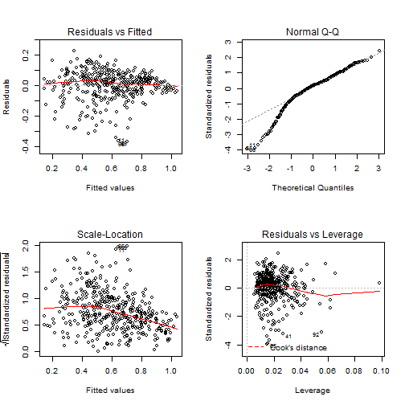

<i>Fitted vs Residual graph</i>
<br/>
Residuals plots should be random in nature and there should not be any pattern in the graph. The average of the residual plot should be close to zero. From the above plot, we can see that the red trend line is almost at zero except at the starting location.

<i>Normal Q-Q Plot</i>
</br>
Q-Q plot shows whether the residuals are normally distributed. Ideally, the plot should be on the dotted line. If the Q-Q plot is not on the line then models need to be reworked to make the residual normal. In the above plot, we see that most of the plots are on the line except at towards the start.

<i>Scale-Location</i>
</br>
This shows how the residuals are spread and whether the residuals have an equal variance or not.

<i>Residuals vs Leverage</i>
</br>
The plot helps to find influential observations. Here we need to check for points that are outside the dashed line. A point outside the dashed line will be influential point and removal of that will affect the regression coefficients.

####Model Building- Model2
As the next step, we can remove the lesser significance features (‘University Ranking' and ‘SOP’) and check the model again.


```r
model2 = update(model1,~.-University.Ranking-SOP)
summary(model2)
```

```
## 
## Call:
## lm(formula = Chance.of.Admit ~ GRE.Scores + TOEFL.Scores + LOR + 
##     CGPA + Research, data = train)
## 
## Residuals:
##      Min       1Q   Median       3Q      Max 
## -0.36985 -0.04019  0.01378  0.05673  0.22874 
## 
## Coefficients:
##              Estimate Std. Error t value Pr(>|t|)    
## (Intercept)   0.01484    0.01558   0.952 0.341586    
## GRE.Scores    0.16466    0.04417   3.728 0.000222 ***
## TOEFL.Scores  0.12223    0.04225   2.893 0.004033 ** 
## LOR           0.13575    0.02710   5.010 8.24e-07 ***
## CGPA          0.58736    0.05252  11.183  < 2e-16 ***
## Research      0.03687    0.01144   3.222 0.001378 ** 
## ---
## Signif. codes:  0 '***' 0.001 '**' 0.01 '*' 0.05 '.' 0.1 ' ' 1
## 
## Residual standard error: 0.09384 on 394 degrees of freedom
## Multiple R-squared:  0.8213,	Adjusted R-squared:  0.819 
## F-statistic: 362.1 on 5 and 394 DF,  p-value: < 2.2e-16
```
####Observation from summary
<i>Is there a relationship between predictor and response variables?</i>
<br/>
F=362.1 is far greater than 1 and this value is more than the F value of the previous model. It can be concluded that there is a relationship between predictor and response variable.

<i>Which of the predictor variables are significant?</i>
<br/>
Now in this model, all the predictors are significant.

<i>Is this model fit?</i>
<br/>
R2 =0.8213 is closer to 1 and so this model is a good fit. Please note that this value has decreased a little from the first model but this should be fine as removing two predictors caused a drop from 0.8233 to 0.8213 and this is a small drop. In other words, the contribution of three predictors towards explaining the variance is an only small value(0.002) and hence it is better to drop the predictor.

####Observation from plot

```r
par(mfrow=c(2,2))
plot(model1)
```


All the four plots look similar to the previous model and we don’t see any major effect

####Check for predictor vs Residual Plot

In the next step, we will check the residual graph for all significant features from Model 2. We need to check if we see any pattern in the residual plot. 
Ideally, the residual plot should be random plot and we should not see a pattern. In the following plots, we can see some non-linear pattern for features like ‘LOR','CGPA'

#####Plot the residual plot with all predictors.


```r
attach(train)
```

```
## The following objects are masked from train (pos = 3):
## 
##     CGPA, Chance.of.Admit, GRE.Scores, LOR, Research, SOP,
##     TOEFL.Scores, University.Ranking
```

```
## The following objects are masked from train (pos = 4):
## 
##     CGPA, Chance.of.Admit, GRE.Scores, LOR, Research, SOP,
##     TOEFL.Scores, University.Ranking
```

```
## The following objects are masked from train (pos = 5):
## 
##     CGPA, Chance.of.Admit, GRE.Scores, LOR, Research, SOP,
##     TOEFL.Scores, University.Ranking
```

```
## The following objects are masked from train (pos = 6):
## 
##     CGPA, Chance.of.Admit, GRE.Scores, LOR, Research, SOP,
##     TOEFL.Scores, University.Ranking
```

```
## The following objects are masked from train (pos = 7):
## 
##     CGPA, Chance.of.Admit, GRE.Scores, LOR, Research, SOP,
##     TOEFL.Scores, University.Ranking
```

```
## The following objects are masked from train (pos = 8):
## 
##     CGPA, Chance.of.Admit, GRE.Scores, LOR, Research, SOP,
##     TOEFL.Scores, University.Ranking
```

```
## The following objects are masked from train (pos = 9):
## 
##     CGPA, Chance.of.Admit, GRE.Scores, LOR, Research, SOP,
##     TOEFL.Scores, University.Ranking
```

```
## The following objects are masked from train (pos = 10):
## 
##     CGPA, Chance.of.Admit, GRE.Scores, LOR, Research, SOP,
##     TOEFL.Scores, University.Ranking
```

```
## The following objects are masked from train (pos = 11):
## 
##     CGPA, Chance.of.Admit, GRE.Scores, LOR, Research, SOP,
##     TOEFL.Scores, University.Ranking
```

```
## The following objects are masked from train (pos = 12):
## 
##     CGPA, Chance.of.Admit, GRE.Scores, LOR, Research, SOP,
##     TOEFL.Scores, University.Ranking
```

```
## The following objects are masked from train (pos = 13):
## 
##     CGPA, Chance.of.Admit, GRE.Scores, LOR, Research, SOP,
##     TOEFL.Scores, University.Ranking
```

```
## The following objects are masked from train (pos = 14):
## 
##     CGPA, Chance.of.Admit, GRE.Scores, LOR, Research, SOP,
##     TOEFL.Scores, University.Ranking
```

```
## The following objects are masked from train (pos = 15):
## 
##     CGPA, Chance.of.Admit, GRE.Scores, LOR, Research, SOP,
##     TOEFL.Scores, University.Ranking
```

```
## The following objects are masked from train (pos = 16):
## 
##     CGPA, Chance.of.Admit, GRE.Scores, LOR, Research, SOP,
##     TOEFL.Scores, University.Ranking
```

```
## The following objects are masked from train (pos = 17):
## 
##     CGPA, Chance.of.Admit, GRE.Scores, LOR, Research, SOP,
##     TOEFL.Scores, University.Ranking
```

```
## The following objects are masked from train (pos = 18):
## 
##     CGPA, Chance.of.Admit, GRE.Scores, LOR, Research, SOP,
##     TOEFL.Scores, University.Ranking
```

```
## The following objects are masked from train (pos = 19):
## 
##     CGPA, Chance.of.Admit, GRE.Scores, LOR, Research, SOP,
##     TOEFL.Scores, University.Ranking
```

```
## The following objects are masked from train (pos = 20):
## 
##     CGPA, Chance.of.Admit, GRE.Scores, LOR, Research, SOP,
##     TOEFL.Scores, University.Ranking
```

```
## The following objects are masked from train (pos = 21):
## 
##     CGPA, Chance.of.Admit, GRE.Scores, LOR, Research, SOP,
##     TOEFL.Scores, University.Ranking
```

```
## The following objects are masked from train (pos = 22):
## 
##     CGPA, Chance.of.Admit, GRE.Scores, LOR, Research, SOP,
##     TOEFL.Scores, University.Ranking
```

```
## The following objects are masked from train (pos = 23):
## 
##     CGPA, Chance.of.Admit, GRE.Scores, LOR, Research, SOP,
##     TOEFL.Scores, University.Ranking
```

```
## The following objects are masked from train (pos = 25):
## 
##     CGPA, Chance.of.Admit, GRE.Scores, LOR, Research, SOP,
##     TOEFL.Scores, University.Ranking
```

```r
require(gridExtra)
plot1 = ggplot(train, aes(GRE.Scores, residuals(model2))) + geom_point() + geom_smooth()
plot2=ggplot(train, aes(TOEFL.Scores, residuals(model2))) + geom_point() + geom_smooth()
plot3=ggplot(train, aes(LOR, residuals(model2))) + geom_point() + geom_smooth()
plot4=ggplot(train, aes(CGPA, residuals(model2))) + geom_point() + geom_smooth()
plot5=ggplot(train, aes(Research, residuals(model2))) + geom_point() + geom_smooth()
grid.arrange(plot1,plot2,plot3,plot4,plot5,ncol=3,nrow=2)
```

```
## `geom_smooth()` using method = 'loess' and formula 'y ~ x'
```

```
## `geom_smooth()` using method = 'loess' and formula 'y ~ x'
## `geom_smooth()` using method = 'loess' and formula 'y ~ x'
## `geom_smooth()` using method = 'loess' and formula 'y ~ x'
## `geom_smooth()` using method = 'loess' and formula 'y ~ x'
```

```
## Warning in simpleLoess(y, x, w, span, degree = degree, parametric =
## parametric, : pseudoinverse used at -0.005
```

```
## Warning in simpleLoess(y, x, w, span, degree = degree, parametric =
## parametric, : neighborhood radius 1.005
```

```
## Warning in simpleLoess(y, x, w, span, degree = degree, parametric =
## parametric, : reciprocal condition number 2.4652e-030
```

```
## Warning in simpleLoess(y, x, w, span, degree = degree, parametric =
## parametric, : There are other near singularities as well. 1.01
```

```
## Warning in predLoess(object$y, object$x, newx = if
## (is.null(newdata)) object$x else if (is.data.frame(newdata))
## as.matrix(model.frame(delete.response(terms(object)), : pseudoinverse used
## at -0.005
```

```
## Warning in predLoess(object$y, object$x, newx = if
## (is.null(newdata)) object$x else if (is.data.frame(newdata))
## as.matrix(model.frame(delete.response(terms(object)), : neighborhood radius
## 1.005
```

```
## Warning in predLoess(object$y, object$x, newx = if
## (is.null(newdata)) object$x else if (is.data.frame(newdata))
## as.matrix(model.frame(delete.response(terms(object)), : reciprocal
## condition number 2.4652e-030
```

```
## Warning in predLoess(object$y, object$x, newx = if
## (is.null(newdata)) object$x else if (is.data.frame(newdata))
## as.matrix(model.frame(delete.response(terms(object)), : There are other
## near singularities as well. 1.01
```

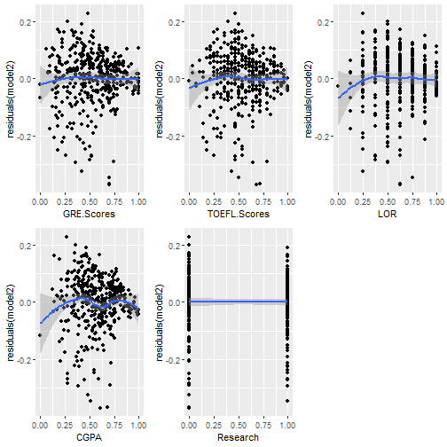

####Model Building- Model3 & Model4
We can now enhance the model by adding a square term to check for non-linearity. We can first try model3 by introducing square terms for all features ( from model 2). And in the next iteration, we can remove the insignificant feature from the model.


```r
#Lets  make default model and add square term in the model.

model3 = lm(Chance.of.Admit~GRE.Scores+TOEFL.Scores+University.Ranking+SOP+LOR+CGPA+Research+ I(GRE.Scores^2)+ I(TOEFL.Scores^2)+I(University.Ranking^2)+ I(SOP^2)+ I(LOR^2)+ 
I(CGPA^2)+ I(Research^2), data=train)
summary(model3)
```

```
## 
## Call:
## lm(formula = Chance.of.Admit ~ GRE.Scores + TOEFL.Scores + University.Ranking + 
##     SOP + LOR + CGPA + Research + I(GRE.Scores^2) + I(TOEFL.Scores^2) + 
##     I(University.Ranking^2) + I(SOP^2) + I(LOR^2) + I(CGPA^2) + 
##     I(Research^2), data = train)
## 
## Residuals:
##      Min       1Q   Median       3Q      Max 
## -0.37142 -0.03658  0.01256  0.05238  0.23968 
## 
## Coefficients: (1 not defined because of singularities)
##                         Estimate Std. Error t value Pr(>|t|)    
## (Intercept)             -0.03177    0.03742  -0.849  0.39630    
## GRE.Scores               0.19846    0.12198   1.627  0.10456    
## TOEFL.Scores             0.15982    0.13355   1.197  0.23216    
## University.Ranking      -0.12066    0.07220  -1.671  0.09548 .  
## SOP                     -0.03635    0.09603  -0.378  0.70527    
## LOR                      0.28255    0.11219   2.518  0.01219 *  
## CGPA                     0.68505    0.16679   4.107 4.89e-05 ***
## Research                 0.03610    0.01147   3.147  0.00178 ** 
## I(GRE.Scores^2)         -0.03580    0.11819  -0.303  0.76216    
## I(TOEFL.Scores^2)       -0.05014    0.12371  -0.405  0.68548    
## I(University.Ranking^2)  0.13995    0.06296   2.223  0.02680 *  
## I(SOP^2)                 0.07536    0.08146   0.925  0.35545    
## I(LOR^2)                -0.14281    0.09009  -1.585  0.11374    
## I(CGPA^2)               -0.11841    0.15134  -0.782  0.43447    
## I(Research^2)                 NA         NA      NA       NA    
## ---
## Signif. codes:  0 '***' 0.001 '**' 0.01 '*' 0.05 '.' 0.1 ' ' 1
## 
## Residual standard error: 0.09317 on 386 degrees of freedom
## Multiple R-squared:  0.8274,	Adjusted R-squared:  0.8216 
## F-statistic: 142.3 on 13 and 386 DF,  p-value: < 2.2e-16
```


```r
##Removing the insignificant variables.
model4=update(model3, ~.-GRE.Scores-TOEFL.Scores-University.Ranking-SOP-I(GRE.Scores^2)-I(TOEFL.Scores^2)-I(SOP^2)-I(LOR^2)-I(CGPA^2)-I(Research^2))
summary(model4)
```

```
## 
## Call:
## lm(formula = Chance.of.Admit ~ LOR + CGPA + Research + I(University.Ranking^2), 
##     data = train)
## 
## Residuals:
##      Min       1Q   Median       3Q      Max 
## -0.34737 -0.04055  0.01195  0.05807  0.28778 
## 
## Coefficients:
##                         Estimate Std. Error t value Pr(>|t|)    
## (Intercept)              0.04091    0.01756   2.329 0.020340 *  
## LOR                      0.10704    0.02900   3.691 0.000254 ***
## CGPA                     0.78624    0.03947  19.919  < 2e-16 ***
## Research                 0.05025    0.01141   4.402 1.38e-05 ***
## I(University.Ranking^2)  0.06872    0.02155   3.189 0.001543 ** 
## ---
## Signif. codes:  0 '***' 0.001 '**' 0.01 '*' 0.05 '.' 0.1 ' ' 1
## 
## Residual standard error: 0.09719 on 395 degrees of freedom
## Multiple R-squared:  0.8078,	Adjusted R-squared:  0.8058 
## F-statistic:   415 on 4 and 395 DF,  p-value: < 2.2e-16
```


```r
par(mfrow=c(2,2))
plot(model4)
```

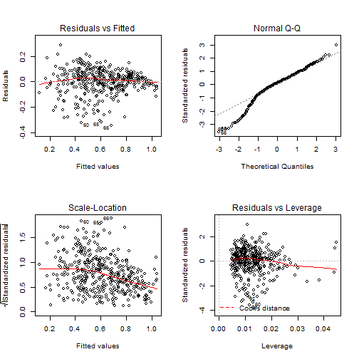

####Observation from summary

<i>Is there a relationship between predictor and response variables?</i>
</br>
F-Stat is 415 and it is far greater than 1. So there is a relationship between predictor and response variable.

<i>Which of the predictor variable are significant?</i>
All predictor variables are significant.

<i>Is this model fit?</i>
R2 is 0.8078 and this is less ( and worse ) than our first and second model.

#####Generally, we choose the model2 that have higher adjusted and predicted R-squared values.

####Prediction

Till now we were checking training-error but the real goal of the model is to reduce the testing error. As we already split the sample dataset into training and testing dataset, we will use test dataset to evaluate the model that we have arrived upon.

We will make a prediction based on ‘Model 2’ and will evaluate the model


```r
pred1 <- predict(model2, newdata = test)
value1 <- data.frame(test,pred1)
colnames(value1) <- c("GRE Scores","TOEFL Scores","University Ranking","SOP","LOR","CGPA","Research","Actual Value","Predict value")
head(value1)
```

```
##    GRE Scores TOEFL Scores University Ranking   SOP   LOR      CGPA
## 8        0.36    0.3214286               0.25 0.500 0.750 0.3525641
## 9        0.24    0.3571429               0.00 0.250 0.125 0.3846154
## 10       0.66    0.5714286               0.50 0.625 0.500 0.5769231
## 18       0.58    0.5000000               0.50 0.750 0.500 0.3846154
## 20       0.26    0.3571429               0.50 0.625 0.500 0.5448718
## 25       0.92    0.9642857               1.00 0.750 0.625 0.9615385
##    Research Actual Value Predict value
## 8         0    0.5396825     0.4222948
## 9         0    0.2539683     0.3408826
## 10        0    0.1746032     0.6000909
## 18        1    0.4920635     0.5020993
## 20        0    0.4444444     0.4892102
## 25        1    1.0000000     0.9706613
```

```r
rmse1 <- sqrt(sum((exp(pred1) - test$Chance.of.Admit)^2)/length(test$Chance.of.Admit))
ra1=summary(model2)$r.squared
c(RMSE = rmse1, R2=ra1)
```

```
##      RMSE        R2 
## 1.2947979 0.8212754
```

As the last step, we will predict the ‘test’ observation and will see the comparison between predicted response and actual response value. 
<i>RMSE explains on an average how much of the predicted value will be from the actual value. Based on RMSE = 1.2947979, we can conclude that on an average predicted value will be off by 1.2947979 from the actual value.<i>


```r
par(mfrow=c(1,1))
plot(test$Chance.of.Admit, exp(pred1))
```

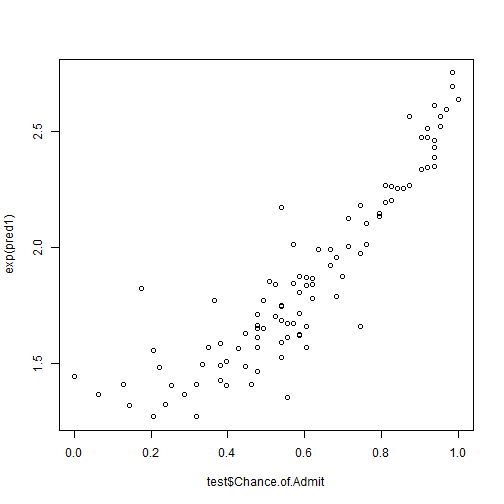

#####De Normalization

```r
minvec <- sapply(df,min)
maxvec <- sapply(df,max)
denormalize <- function(x,minval,maxval) {
    x*(maxval-minval) + minval
}
dedfNorm <-as.data.frame(Map(denormalize,test,minvec,maxvec))
value12 <- data.frame(dedfNorm,pred1)
head(value12)
```

```
##    GRE.Scores TOEFL.Scores University.Ranking SOP LOR CGPA Research
## 8         308          101                  2 3.0 4.0  7.9        0
## 9         302          102                  1 2.0 1.5  8.0        0
## 10        323          108                  3 3.5 3.0  8.6        0
## 18        319          106                  3 4.0 3.0  8.0        1
## 20        303          102                  3 3.5 3.0  8.5        0
## 25        336          119                  5 4.0 3.5  9.8        1
##    Chance.of.Admit     pred1
## 8             0.68 0.4222948
## 9             0.50 0.3408826
## 10            0.45 0.6000909
## 18            0.65 0.5020993
## 20            0.62 0.4892102
## 25            0.97 0.9706613
```
####Model Building- Model5
We will fit the random forest model.

#####Fitting the Random Forest

```r
require(randomForest)
df.rf=randomForest(Chance.of.Admit ~ . , data =train)
df.rf
```

```
## 
## Call:
##  randomForest(formula = Chance.of.Admit ~ ., data = train) 
##                Type of random forest: regression
##                      Number of trees: 500
## No. of variables tried at each split: 2
## 
##           Mean of squared residuals: 0.009601854
##                     % Var explained: 80.21
```

The above Mean Squared Error and Variance explained are calculated using Out of Bag Error Estimation.
In this 2/3 of Training data is used for training and the remaining 1/3 is used to Validate the Trees. 
<br/>
Also, the number of variables randomly selected at each split is 2.

####Prediction

```r
pred2 <- predict(df.rf, newdata = test)
denormalize <-function(x){
  return((normalize(x))*(max(x)-min(x))+min(x))
} 
pred21 <- 
value2 <- data.frame(test,pred2)
colnames(value2) <- c("GRE Scores","TOEFL Scores","University Ranking","SOP","LOR","CGPA","Research","Actual Value","Predict value")
head(value2)
```

```
##    GRE Scores TOEFL Scores University Ranking   SOP   LOR      CGPA
## 8        0.36    0.3214286               0.25 0.500 0.750 0.3525641
## 9        0.24    0.3571429               0.00 0.250 0.125 0.3846154
## 10       0.66    0.5714286               0.50 0.625 0.500 0.5769231
## 18       0.58    0.5000000               0.50 0.750 0.500 0.3846154
## 20       0.26    0.3571429               0.50 0.625 0.500 0.5448718
## 25       0.92    0.9642857               1.00 0.750 0.625 0.9615385
##    Research Actual Value Predict value
## 8         0    0.5396825     0.4314665
## 9         0    0.2539683     0.3539939
## 10        0    0.1746032     0.5922603
## 18        1    0.4920635     0.5452525
## 20        0    0.4444444     0.4860293
## 25        1    1.0000000     0.9554614
```

```r
rmse2 <- sqrt(sum((exp(pred2) - test$Chance.of.Admit)^2)/length(test$Chance.of.Admit))
y <- test[,1]
ra2<-1 -sum((y-pred2)^2)/sum((y-mean(y))^2)
c(RMSE = rmse2,R2=ra2)
```

```
##      RMSE        R2 
## 1.2940630 0.6289905
```

####Model Building- Model6
We will fit the decision tree regression.

#####Fitting the Decision tree

```r
require(rpart)
df.dt=rpart(Chance.of.Admit ~GRE.Scores+TOEFL.Scores+University.Ranking+SOP+LOR+CGPA+Research, method="anova",data =train)
df.dt
```

```
## n= 400 
## 
## node), split, n, deviance, yval
##       * denotes terminal node
## 
##  1) root 400 19.4118200 0.6071825  
##    2) CGPA< 0.6201923 234  6.3176240 0.4707638  
##      4) CGPA< 0.3477564 51  0.9182043 0.2763772 *
##      5) CGPA>=0.3477564 183  2.9352670 0.5249371  
##       10) CGPA< 0.4887821 93  1.4091680 0.4760198 *
##       11) CGPA>=0.4887821 90  1.0736010 0.5754850 *
##    3) CGPA>=0.6201923 166  2.6008020 0.7994836  
##      6) CGPA< 0.7548077 97  0.9168271 0.7203404  
##       12) CGPA< 0.7227564 69  0.5883277 0.6912813 *
##       13) CGPA>=0.7227564 28  0.1266512 0.7919501 *
##      7) CGPA>=0.7548077 69  0.2222733 0.9107430 *
```

Note the method in this model is anova. This means we are going to try to predict a number value. If we were doing a classifier model, the method would be class.

#####Plot model


```r
plot(df.dt, uniform=TRUE, 
 main="Regression Tree for Chance of Admit")
 text(df.dt, use.n=TRUE, cex = .6)
```

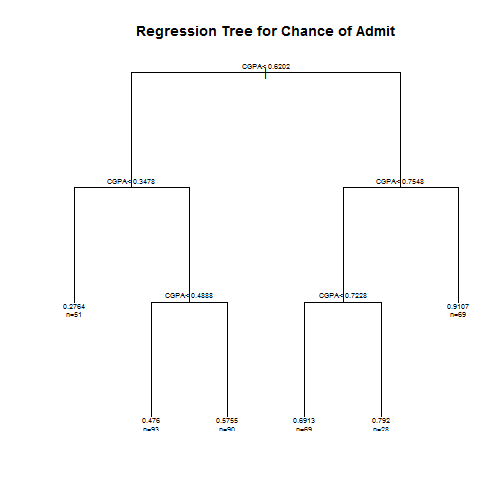

Note the splits are marked – like the top split is CGPA < 0.6202

####Prediction

```r
pred3 <- predict(df.dt, newdata = test)
value3 <- data.frame(test,pred3)
colnames(value3) <- c("GRE Scores","TOEFL Scores","University Ranking","SOP","LOR","CGPA","Research","Actual Value","Predict value")
head(value3)
```

```
##    GRE Scores TOEFL Scores University Ranking   SOP   LOR      CGPA
## 8        0.36    0.3214286               0.25 0.500 0.750 0.3525641
## 9        0.24    0.3571429               0.00 0.250 0.125 0.3846154
## 10       0.66    0.5714286               0.50 0.625 0.500 0.5769231
## 18       0.58    0.5000000               0.50 0.750 0.500 0.3846154
## 20       0.26    0.3571429               0.50 0.625 0.500 0.5448718
## 25       0.92    0.9642857               1.00 0.750 0.625 0.9615385
##    Research Actual Value Predict value
## 8         0    0.5396825     0.4760198
## 9         0    0.2539683     0.4760198
## 10        0    0.1746032     0.5754850
## 18        1    0.4920635     0.4760198
## 20        0    0.4444444     0.5754850
## 25        1    1.0000000     0.9107430
```

```r
rmse3 <- sqrt(sum((exp(pred2) - test$Chance.of.Admit)^2)/length(test$Chance.of.Admit))
y1 <- test[,1]
ra3 <-1 -sum((y1-pred3)^2)/sum((y1-mean(y1))^2)
c(RMSE = rmse3,R2=ra3)
```

```
##      RMSE        R2 
## 1.2940630 0.4244961
```

####Comparision of Regression Algortihm


```r
coraplot <-data.frame(Name=c("LinearRegression","RandomForestReg.","DecisionTreeReg."),R2=c(ra1,ra2,ra3))
p2 <- ggplot(data=coraplot, aes(x=coraplot$Name,y=coraplot$R2)) +geom_bar(stat = "identity",aes(fill=Name))+ geom_text(aes(label=coraplot$R2),vjust=-0.5, position = position_dodge(width = 1), size = 4)
p2 <- p2+ labs(x="Regressor",y="R2 Score",title = "Comparision of Regression Algortihms")
p2<- p2 + theme_bw()+theme(legend.position="bottom")
p2 <- p2+theme(legend.text=element_text(size=10), legend.title=element_text(size=14))
p2 <- p2 + theme(axis.text.x=element_text(color="black", size=15, face="bold"),
               plot.title = element_text(color="black", size=15, face="bold"),
               axis.text.y=element_text(colour="grey20", face="bold", hjust=1, vjust=0.8, size=10),
               axis.title.y=element_text(colour="grey20", face="bold", size=12))
p2
```

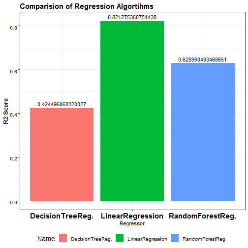

Linear regression and random forest regression algorithms were better than decision tree regression algorithm.


```r
value <- data.frame(test$Chance.of.Admit,value1$`Predict value`,value2$`Predict value`,value3$`Predict value`)
colnames(value) <- c("Actual Value", "LinearReg Prediction","RandomForest Prediction","DecisionTreeReg Prediction")
head(value)
```

```
##   Actual Value LinearReg Prediction RandomForest Prediction
## 1    0.5396825            0.4222948               0.4314665
## 2    0.2539683            0.3408826               0.3539939
## 3    0.1746032            0.6000909               0.5922603
## 4    0.4920635            0.5020993               0.5452525
## 5    0.4444444            0.4892102               0.4860293
## 6    1.0000000            0.9706613               0.9554614
##   DecisionTreeReg Prediction
## 1                  0.4760198
## 2                  0.4760198
## 3                  0.5754850
## 4                  0.4760198
## 5                  0.5754850
## 6                  0.9107430
```
